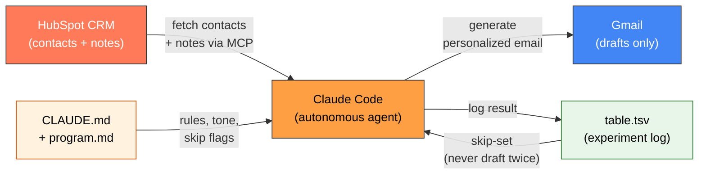

<p align="center">
  <h1 align="center">HubSpot Email Agent</h1>
  <p align="center">
    Autonomous email agent — reads HubSpot leads, generates personalized follow-ups, saves as Gmail drafts via Claude Code.
  </p>
</p>

<p align="center">
  <a href="https://nodejs.org/"></a>
  <a href="LICENSE"></a>
  <a href="https://developers.hubspot.com/"></a>
  <a href="https://claude.ai/code"></a>
</p>

---

## What Is This?

An autonomous Claude Code agent that reads your HubSpot CRM contacts and their notes, generates personalized follow-up emails, and saves them as Gmail drafts. You wake up to a full inbox of ready-to-review drafts — never sends anything without your approval.

Follows [Andrej Karpathy's autoresearch pattern](https://github.com/karpathy/autoresearch): fully autonomous looping with TSV-based experiment tracking, running until manually interrupted.

---

## How It Works



### The Loop (per contact)

1. **Read notes** from HubSpot (project type, budget, last conversation)
2. **Check skip flags** (configurable phrases that mean "don't contact")
3. **Extract context** — what they wanted, where things left off, any special details
4. **Generate email** — tone and greeting determined by lead status
5. **Create Gmail draft** — never sends, only drafts
6. **Log to table.tsv** — tracks every contact, prevents duplicates
7. **Next contact** — no pausing, no asking, fully autonomous

---

## Architecture

```
hubspot-email-agent/
├── program.md               # Agent instructions (the loop, constraints, error handling)
├── CLAUDE.md                # Email rules (tone, examples, quality standards)
├── prompts/
│   └── run-followup.md      # 5 execution modes (autonomous, preview, resume, single, approval)
├── src/
│   └── tracker.js           # TSV tracking utility (read, exists, append)
├── table.tsv                # Experiment log (Karpathy pattern)
├── output/
│   └── errors.log           # Error log (auto-created at runtime)
└── package.json             # Node.js config + npm scripts
```

### MCP Integrations

| Tool | Purpose |
|------|---------|
| **HubSpot** (`search_crm_objects`) | Fetch contacts, notes, lead status |
| **Gmail** (`gmail_create_draft`) | Create email drafts — never sends |

---

## Features

### 5 Execution Modes

| Mode | What It Does |
|------|-------------|
| **Autonomous** | Process all contacts in a loop — never stops until interrupted |
| **Preview** | Generate emails to console only — no Gmail, no logging (max 10) |
| **Resume** | Continue from where you left off — skips already-processed contacts |
| **Single Contact** | Test one contact — shows email + reasoning, no draft created |
| **Approval** | Show each email for manual approval before drafting |

### Smart Deduplication
- TSV-based tracking prevents drafting the same contact twice
- Resume mode picks up exactly where an interrupted run left off

### Configurable Skip Flags
- Define phrases in notes that mean "don't contact this person"
- Skipped contacts are logged with the reason

### Context-Aware Emails
- Extracts project type, budget, and conversation status from HubSpot notes
- Tone and greeting automatically adjusted by lead status
- Subject lines reference the actual project, not generic "Follow-up"

---

## Prerequisites

- **Node.js 18+**
- **Claude Code** — [Get started](https://claude.ai/code)
- **HubSpot account** with API access (MCP integration)
- **Gmail account** connected via MCP

---

## Installation

```bash
# Clone the repository
git clone https://github.com/Dominien/hubspot-email-agent.git
cd hubspot-email-agent
```

No `npm install` needed — the only dependency is Node.js for the tracker utility.

### Configure Your Context

1. **Edit `CLAUDE.md`** — Replace the placeholder values:
   - `YOUR_NAME` — your name
   - `YOUR_EMAIL` — your email address
   - `YOUR_DOMAIN` — your website/company
   - Customize the email tone rules and examples for your business

2. **Edit `program.md`** — Customize:
   - Skip flags (phrases in notes that mean "don't contact")
   - Lead status exclusions (statuses to ignore)

3. **Set up MCP integrations** in Claude Code:
   - HubSpot MCP server
   - Gmail MCP server

---

## Usage

### Start the Autonomous Loop

```bash
npm start
```

Or run directly in Claude Code:

```
Read program.md and CLAUDE.md, then start the autonomous HubSpot follow-up loop.
NEVER STOP. Work through all contacts until manually stopped.
```

### Preview Mode (safe — no drafts created)

```
Read program.md and CLAUDE.md, then start in PREVIEW MODE.
Show emails in console only. No Gmail calls. Max 10 contacts.
```

### Test a Single Contact

```
Read program.md and CLAUDE.md. Process ONLY this one contact:
Email: someone@example.com
Show me the email + reasoning. Do NOT create a draft.
```

### Check Tracking

```bash
# See all processed emails
node src/tracker.js read

# Check if a specific email was already processed
node src/tracker.js exists "someone@example.com"
```

See `prompts/run-followup.md` for all 5 execution modes.

---

## The Tracking System

Inspired by [Karpathy's autoresearch](https://github.com/karpathy/autoresearch) pattern, every contact processed gets logged to `table.tsv`:

| Column | Content |
|--------|---------|
| `email` | Contact email (lowercase, deduplicated) |
| `firstname` | First name |
| `lastname` | Last name |
| `company` | Company name |
| `lead_status` | HubSpot lead status |
| `notes_summary` | Key context extracted (max 1 sentence) |
| `draft_id` | Gmail draft ID (for reference) |
| `status` | `drafted`, `skipped`, or `error` |
| `drafted_at` | ISO timestamp |

This ensures:
- No contact is ever drafted twice
- You can resume interrupted runs seamlessly
- Full audit trail of what was generated and why

---

## Safety

- **Drafts only** — the agent can never send emails, only create drafts
- **You review everything** — drafts sit in Gmail until you manually send them
- **Skip flags** — contacts with certain notes are automatically excluded
- **Deduplication** — impossible to accidentally draft the same person twice
- **Approval mode** — optionally review each email before it becomes a draft

---

## Extending

### Add New Lead Statuses
Edit the tone table in `CLAUDE.md` to add your custom HubSpot lead statuses.

### Change the Email Language
The examples in `CLAUDE.md` can be in any language. Replace the examples and tone rules to match your needs.

### Add More Skip Flags
Edit the skip flag list in `program.md` Step 2 to match your team's CRM conventions.

### Custom Tracking Fields
Modify the TSV header in `src/tracker.js` (line 21) to track additional fields.

---

## Known Limitations

- Requires HubSpot and Gmail MCP servers configured in Claude Code
- Notes extraction depends on consistent note formatting in your CRM
- Gmail API rate limits may slow down large batches
- No email sending — by design (drafts only)

---

## Contributing

Contributions are welcome! See [CONTRIBUTING.md](CONTRIBUTING.md) for guidelines.

## Security

See [SECURITY.md](SECURITY.md) for reporting vulnerabilities.

## License

[MIT](LICENSE) - Marco Patzelt
