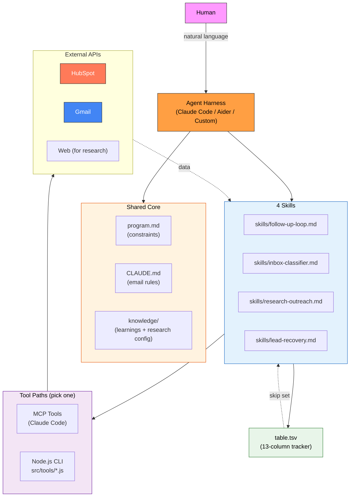

<p align="center">
  <h1 align="center">HubSpot Sales Agent</h1>
  <p align="center">
    Your autonomous sales team — bulk outreach, inbox classification, research-driven personalization, and lead recovery.<br>
    Runs on any local agent harness.
  </p>
</p>

<p align="center">
  <a href="https://nodejs.org/"></a>
  <a href="LICENSE"></a>
  <a href="https://developers.hubspot.com/"></a>
  <a href="https://developers.google.com/gmail/api"></a>
  <a href="AGENTS.md"></a>
</p>

---

## What Is This?

A modular, autonomous sales agent that automates the outbound sales workflow. It reads contacts and deals from HubSpot, generates personalized email drafts in Gmail, classifies replies, and tracks everything in a single TSV file. **It never sends emails on its own** — it prepares drafts for human review.

The agent is **branche-agnostic** (works for any industry) and **harness-agnostic** (runs on Claude Code, or any local agent harness via plain CLI tools).

---

## Four Composable Skills

| Skill | What It Does |
|-------|-------------|
| **follow-up-loop** | Autonomous bulk outreach to HubSpot contacts — drafts personalized follow-ups until stopped |
| **inbox-classifier** | Reads incoming replies, classifies them into 8 categories, drafts responses to positive replies, and syncs HubSpot status |
| **research-outreach** | Researches a lead's website/business using a configurable audit type, embeds top findings in a personalized email |
| **lead-recovery** | Decision framework for stale/burned-out deals — recommends recovery levers or pipeline cleanup |

Each skill is self-contained. Invoke them independently or combine them in workflows.

---

## Architecture



---

## Project Structure

```
hubspot-sales-agent/
├── program.md                    # Shared constraints, setup, error handling
├── CLAUDE.md                     # Shared email generation rules (greeting, tone, templates)
├── AGENTS.md                     # Harness compatibility guide
├── skills/                       # 4 composable skills
│   ├── follow-up-loop.md         # Bulk outreach autonomous loop
│   ├── inbox-classifier.md       # 8-category reply classification + auto-drafts
│   ├── research-outreach.md      # Research-driven personalized outreach
│   └── lead-recovery.md          # Decision framework for stale deals
├── knowledge/                    # Living knowledge base (edit for your business)
│   ├── learnings.md              # Track what works over time
│   └── research-config.md        # Define your research/audit approach
├── prompts/
│   ├── invoke-skill.md           # All skill invocations + workflows
│   └── run-followup.md           # Quick-start prompts
├── src/
│   ├── tracker.js                # TSV tracker CLI (read/exists/append/update)
│   └── tools/                    # Harness-agnostic CLI wrappers
│       ├── hubspot.js            # HubSpot REST API
│       ├── gmail.js              # Gmail API (OAuth)
│       └── webfetch.js           # HTML fetch + basic audit
├── output/
│   ├── research-reports/         # Full research reports per lead (markdown)
│   ├── errors.log                # Runtime error log
│   └── recovery-*.md             # Lead recovery analysis outputs
├── table.tsv                     # Single source of truth (13 columns, gitignored)
├── .env.example                  # Credential template
├── package.json
└── README.md                     # You are here
```

---

## Works With Any Agent Harness

This agent is **harness-agnostic**. Every skill file references two interchangeable tool paths — pick whichever matches your setup:

### Path A — MCP ([Model Context Protocol](https://modelcontextprotocol.io))
Works with **any MCP-capable harness** — Claude Code, Cursor, Continue, Windsurf, Zed, custom harnesses with an MCP client, etc. Install the HubSpot + Gmail MCP servers and you're done (no `.env` needed for the MCP path — auth is handled by the harness).

### Path B — Local CLI tools (universal fallback)
Works with **any harness** that can execute shell commands. Run `npm install`, fill in `.env`, and the agent shells out to `node src/tools/*.js`. Use this when:
- Your harness doesn't support MCP yet
- You want to debug tool calls directly in the terminal
- You're building a custom Node.js/Python agent loop
- You prefer a minimal dependency footprint

You can also **mix both paths** — for example, use MCP for HubSpot and CLI for webfetch. See [AGENTS.md](AGENTS.md) for details.

---

## Prerequisites

- **Node.js 18+**
- **HubSpot account** with a Private App token
- **Gmail account** with Google Cloud OAuth credentials
- **An agent harness** that can read markdown and execute shell commands (e.g., [Claude Code](https://claude.ai/code))

---

## Installation

```bash
# Clone the repo
git clone https://github.com/Dominien/hubspot-sales-agent.git
cd hubspot-sales-agent

# Install dependencies
npm install

# Set up credentials
cp .env.example .env
# Edit .env with your HubSpot token and Google OAuth credentials
```

### HubSpot Private App Token

1. Go to HubSpot Settings → Integrations → Private Apps
2. Create a new Private App
3. Scopes needed: `crm.objects.contacts.read`, `crm.objects.contacts.write`, `crm.objects.deals.read`, `crm.objects.notes.read`, `crm.objects.notes.write`
4. Copy the token (starts with `pat-`) into `.env` as `HUBSPOT_API_TOKEN`

### Google OAuth (Gmail API)

1. Create a project at [Google Cloud Console](https://console.cloud.google.com/)
2. Enable the Gmail API
3. Create OAuth 2.0 credentials (Desktop app type)
4. Use a tool like [Google OAuth Playground](https://developers.google.com/oauthplayground/) to generate a refresh token with scope `https://www.googleapis.com/auth/gmail.modify`
5. Fill `GOOGLE_CLIENT_ID`, `GOOGLE_CLIENT_SECRET`, and `GOOGLE_REFRESH_TOKEN` in `.env`

### Verify Setup

```bash
node src/tools/hubspot.js --help   # should print usage
node src/tools/gmail.js --help     # should print usage
node src/tools/webfetch.js --help  # should print usage
node src/tracker.js read           # should print []
```

---

## Configuration

### 1. Customize `CLAUDE.md`

Edit the placeholders to match your sender identity and offering:
- `YOUR_NAME` → your name
- `YOUR_EMAIL` → your email
- `YOUR_DOMAIN` → your website / company

Also customize the **email tone table** and **greeting override rules** for your market.

### 2. Define Your Research Approach (`knowledge/research-config.md`)

Pick ONE (or more) audit types that match what you sell:
- **SEO Audit** — for SEO agencies, content marketers
- **UX / Conversion Audit** — for CRO consultants, UX designers
- **Brand / Positioning Audit** — for branding agencies, strategists
- **Tech Stack Audit** — for developers, DevOps, performance specialists
- **Content Strategy Audit** — for content marketers, editors
- **Competitive Analysis** — for market researchers, strategists
- **Custom** — define your own

This is what makes the `research-outreach` skill branche-agnostic.

### 3. (Optional) Start Tracking Learnings (`knowledge/learnings.md`)

As you run outreach waves, document what works in this file. The agent reads it on each run to improve over time.

---

## Usage

### Quickstart: Run the follow-up loop

```
Read skills/follow-up-loop.md and CLAUDE.md, then start the autonomous loop.
NEVER STOP. Work through all HubSpot contacts until manually interrupted.
```

Paste this into your agent harness (Claude Code, Aider, etc.). The agent will:
1. Fetch contacts from HubSpot
2. Read each contact's notes
3. Generate a personalized email
4. Create a Gmail draft
5. Log to `table.tsv`
6. Move to the next contact

### Classify inbox replies

```
Read skills/inbox-classifier.md and CLAUDE.md.
Run with default filter: newer_than:7d in:inbox.
Classify all new replies, create reply drafts for positive ones, update HubSpot status.
```

### Research-driven outreach for a curated list

```
Read skills/research-outreach.md and knowledge/research-config.md.
Run for these leads:
- john@example.com, John Smith, Acme Inc, acme.com, ATTEMPTED_TO_CONTACT
- jane@another.com, Jane Doe, Beta Corp, beta.com, NEW
```

### Analyze stale deals

```
Read skills/lead-recovery.md.
Analyze HubSpot deals older than 6 months with no activity.
Recommend recovery lever per deal.
```

See [`prompts/invoke-skill.md`](prompts/invoke-skill.md) for all invocations, modes, and workflow examples.

---

## Tracking System

Every action is logged to `table.tsv` (13 columns):

| Column | Description | Written By |
|--------|-------------|-----------|
| `email` | Unique identifier (lowercase) | follow-up-loop, research-outreach |
| `firstname`, `lastname`, `company` | Contact master data | follow-up-loop, research-outreach |
| `lead_status` | HubSpot lead status at draft time | follow-up-loop, research-outreach |
| `notes_summary` | 1-sentence summary of HubSpot notes | follow-up-loop, research-outreach |
| `draft_id` | Gmail draft ID of outreach email | follow-up-loop, research-outreach |
| `status` | drafted / skipped / error / declined / bounced / awaiting_human | all |
| `drafted_at` | ISO timestamp of draft creation | follow-up-loop, research-outreach |
| `reply_received_at` | ISO timestamp when reply arrived | inbox-classifier |
| `reply_classification` | POSITIVE_INTENT / POSITIVE_MEETING / NEGATIVE_HARD / etc. | inbox-classifier |
| `reply_draft_id` | Gmail draft ID of reply draft | inbox-classifier |
| `hubspot_status_after` | HubSpot lead status after sync | inbox-classifier |

**Tracker CLI:**
```bash
node src/tracker.js read                                           # JSON array of all emails
node src/tracker.js exists <email>                                 # "true" or "false"
node src/tracker.js append "<tab-separated-row>"                   # add a new row
node src/tracker.js update <email> <classification> [draft_id]    # set reply fields
```

---

## Workflow Examples

### Workflow A — Send Wave + Follow Up

```
Day 0: Run follow-up-loop autonomously → 50-100 drafts in Gmail
Day 0: Human reviews and sends
Day 1-2: Run inbox-classifier with "newer_than:2d"
Day 2: Human reviews reply drafts and sends
```

### Workflow B — Pipeline Recovery

```
1. Run lead-recovery for stale deals → recommendation per deal
2. Build lead list from "value-first" recommendations
3. Run research-outreach with that list
4. Human reviews and sends
5. Run inbox-classifier 1-2 days later
```

### Workflow C — Daily Inbox Maintenance

```
Morning: Run inbox-classifier with "newer_than:1d"
Human reviews reply drafts (5 min) and sends
```

---

## Safety

- **Drafts only** — the agent can never send emails, only create drafts
- **Human review required** — every outgoing message waits in Gmail for manual approval
- **No duplicate drafts** — tracker check prevents drafting the same contact twice
- **Configurable skip flags** — contacts with certain notes are automatically excluded
- **No invented details** — the agent is instructed to stay generic when notes are unclear
- **No destructive HubSpot operations** — the agent only updates lead status and adds notes, never deletes

---

## Extending

### Add a New Skill
1. Create `skills/your-skill.md` following the existing pattern
2. Reference `CLAUDE.md` and `program.md` for shared rules
3. Add invocation prompts to `prompts/invoke-skill.md`
4. Document in `README.md`

### Add a New Tool
1. Create `src/tools/your-tool.js` (ES modules, JSON stdout)
2. Follow the pattern in `hubspot.js` / `gmail.js` (args, auth via `.env`, error handling)
3. Reference it in the skills that need it

### Support a New Harness
See [AGENTS.md](AGENTS.md) for the integration pattern.

---

## Known Limitations

- **Gmail rate limits** — the Gmail API enforces quota limits; large batches may be throttled
- **Notes extraction** — depends on consistent note formatting in your HubSpot CRM
- **Basic webfetch audit** — the built-in `webfetch.js` audit covers basic SEO signals. For richer audits (Lighthouse, full-page render, etc.), extend the tool or integrate an external service
- **OAuth setup** — Gmail OAuth requires a one-time refresh token generation, which can feel clunky. See README for walkthrough
- **No email sending** — by design (drafts only)

---

## Contributing

Contributions are welcome! See [CONTRIBUTING.md](CONTRIBUTING.md).

## Security

See [SECURITY.md](SECURITY.md) for reporting vulnerabilities.

## License

[MIT](LICENSE) — Marco Patzelt
