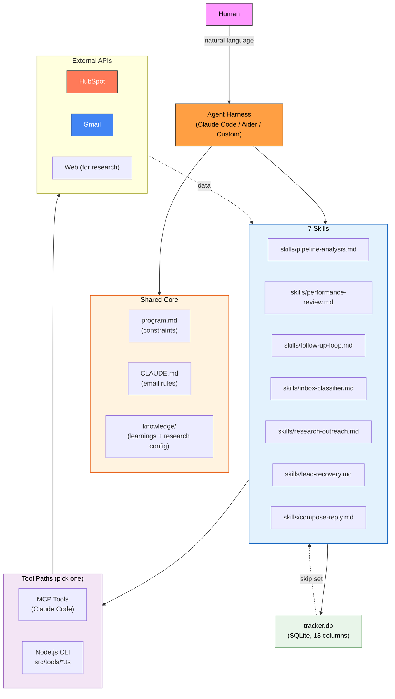

<p align="center">
  <h1 align="center">HubSpot Sales Agent</h1>
  <p align="center">
    Your autonomous sales team — bulk outreach, inbox classification, research-driven personalization, and lead recovery.<br>
    Runs on any local agent harness.
  </p>
</p>

<p align="center">
  <a href="https://nodejs.org/"></a>
  <a href="LICENSE"></a>
  <a href="https://developers.hubspot.com/"></a>
  <a href="https://developers.google.com/gmail/api"></a>
  <a href="AGENTS.md"></a>
</p>

---

## What Is This?

A modular, autonomous sales agent that automates the outbound sales workflow. It reads contacts and deals from HubSpot, generates personalized email drafts in Gmail, classifies replies, and tracks everything in a single TSV file. **It never sends emails on its own** — it prepares drafts for human review.

The agent is **branche-agnostic** (works for any industry) and **harness-agnostic** (runs on Claude Code, or any local agent harness via plain CLI tools).

---

## Seven Composable Skills

| Skill | What It Does |
|-------|-------------|
| **pipeline-analysis** | Analyzes the entire HubSpot pipeline — contacts, deals, segments, agent coverage — and recommends which action-skill to run next (forward-looking) |
| **performance-review** | Closes the feedback loop. Joins tracker drafts with reply outcomes, computes per-segment conversion contrasts, proposes evidence-backed Section C rules for `learnings.md` (backward-looking) |
| **follow-up-loop** | Autonomous bulk outreach to HubSpot contacts — drafts personalized follow-ups until stopped |
| **inbox-classifier** | Reads incoming replies, classifies them into 8 categories, drafts responses to positive replies, and syncs HubSpot status |
| **research-outreach** | Researches a lead's website/business using a configurable audit type, embeds top findings in a personalized email |
| **lead-recovery** | Decision framework for stale/burned-out deals — recommends recovery levers or pipeline cleanup |
| **compose-reply** | Deep-context single-lead composer — assembles full email history + HubSpot data + custom new context and drafts a careful reply for one specific lead |

Each skill is self-contained. Invoke them independently or combine them in workflows. **Monday-morning pair:** run `performance-review` first (what worked last week), then `pipeline-analysis` (what to work on next). The rest of the week runs the action skills the analysis recommended.

---

## Architecture



---

## Project Structure

```
hubspot-sales-agent/
├── program.md                    # Shared constraints, setup, error handling
├── CLAUDE.md                     # Shared email generation rules (greeting, tone, templates)
├── AGENTS.md                     # Harness compatibility guide
├── skills/                       # 7 composable skills
│   ├── pipeline-analysis.md      # Full pipeline health check + recommendations (forward-looking)
│   ├── performance-review.md     # Closes the feedback loop — joins drafts with outcomes, proposes Section C rules (backward-looking)
│   ├── follow-up-loop.md         # Bulk outreach autonomous loop
│   ├── inbox-classifier.md       # 8-category reply classification + auto-drafts
│   ├── research-outreach.md      # Research-driven personalized outreach
│   ├── lead-recovery.md          # Decision framework for stale deals
│   └── compose-reply.md          # Deep-context single-lead composer
├── knowledge/                    # Living knowledge base (edit for your business)
│   ├── learnings.md              # Living memory — skills read on every run, append observations/heartbeats at end (Section A cheat sheets, Section B running log, Section C distilled patterns)
│   ├── learnings-archive.md      # Auto-created when Section B exceeds 100 entries (rotated by src/learnings.ts)
│   └── research-config.md        # Define your research/audit approach
├── prompts/
│   ├── invoke-skill.md           # All skill invocations + workflows
│   └── run-followup.md           # Quick-start prompts
├── src/
│   ├── db.ts                     # Shared SQLite data layer (schema, prepared statements, TSV→SQLite import)
│   ├── tracker.ts                # Tracker CLI — thin wrapper over db.ts (read/rows/exists/append/update/export)
│   ├── learnings.ts              # Learnings CLI (append heartbeat/observation to learnings.md Section B)
│   ├── performance.ts            # Performance math (queries tracker.db via db.ts, computes per-segment contrasts → JSON for performance-review)
│   └── tools/                    # Harness-agnostic CLI wrappers
│       ├── hubspot.ts            # HubSpot REST API
│       ├── gmail.ts              # Gmail API (OAuth)
│       └── webfetch.ts           # HTML fetch + basic audit
├── output/
│   ├── research-reports/         # Full research reports per lead (markdown)
│   ├── analysis/                 # Pipeline analysis reports
│   ├── performance/              # Weekly performance-review reports
│   ├── lead-dossiers/            # Deep-context briefs from compose-reply
│   ├── errors.log                # Runtime error log
│   └── recovery-*.md             # Lead recovery analysis outputs
├── ui/                           # Local dashboard (Next.js 16, App Router)
│   ├── src/app/                  # Pages + API routes wrapping the parent CLIs
│   ├── src/components/           # 4-tab dashboard (pipeline / performance / skills / learnings)
│   ├── src/lib/                  # cli.ts execFile wrapper, skills templates, types
│   └── package.json              # Separate install — see "Dashboard UI" section below
├── tracker.db                    # Single source of truth (SQLite, gitignored) — as of v2.6
├── .env.example                  # Credential template
├── package.json
└── README.md                     # You are here
```

---

## Works With Any Agent Harness

This agent is **harness-agnostic**. Every skill file references two interchangeable tool paths — pick whichever matches your setup:

### Path A — MCP ([Model Context Protocol](https://modelcontextprotocol.io))
Works with **any MCP-capable harness** — Claude Code, Cursor, Continue, Windsurf, Zed, custom harnesses with an MCP client, etc. Install the HubSpot + Gmail MCP servers and you're done (no `.env` needed for the MCP path — auth is handled by the harness).

### Path B — Local CLI tools (universal fallback)
Works with **any harness** that can execute shell commands. Run `npm install`, fill in `.env`, and the agent shells out to `npx tsx src/tools/*.ts`. Use this when:
- Your harness doesn't support MCP yet
- You want to debug tool calls directly in the terminal
- You're building a custom Node.js/Python agent loop
- You prefer a minimal dependency footprint

You can also **mix both paths** — for example, use MCP for HubSpot and CLI for webfetch. See [AGENTS.md](AGENTS.md) for details.

---

## Prerequisites

- **Node.js 18+**
- **HubSpot account** with a Private App token
- **Gmail account** with Google Cloud OAuth credentials
- **An agent harness** that can read markdown and execute shell commands (e.g., [Claude Code](https://claude.ai/code))

---

## Installation

```bash
# Clone the repo
git clone https://github.com/Dominien/hubspot-sales-agent.git
cd hubspot-sales-agent

# Install dependencies
npm install

# Set up credentials
cp .env.example .env
# Edit .env with your HubSpot token and Google OAuth credentials
```

### HubSpot Private App Token

1. Go to HubSpot Settings → Integrations → Private Apps
2. Create a new Private App
3. Scopes needed: `crm.objects.contacts.read`, `crm.objects.contacts.write`, `crm.objects.deals.read`, `crm.objects.notes.read`, `crm.objects.notes.write`
4. Copy the token (starts with `pat-`) into `.env` as `HUBSPOT_API_TOKEN`

### Google OAuth (Gmail API)

1. Create a project at [Google Cloud Console](https://console.cloud.google.com/)
2. Enable the Gmail API
3. Create OAuth 2.0 credentials (Desktop app type)
4. Use a tool like [Google OAuth Playground](https://developers.google.com/oauthplayground/) to generate a refresh token with scope `https://www.googleapis.com/auth/gmail.modify`
5. Fill `GOOGLE_CLIENT_ID`, `GOOGLE_CLIENT_SECRET`, and `GOOGLE_REFRESH_TOKEN` in `.env`

### Verify Setup

```bash
npx tsx src/tools/hubspot.ts --help   # should print usage
npx tsx src/tools/gmail.ts --help     # should print usage
npx tsx src/tools/webfetch.ts --help  # should print usage
npx tsx src/tracker.ts read           # should print []
npx tsx src/learnings.ts --help       # should print usage
npx tsx src/performance.ts --window 7 # should print JSON with zero counts on an empty tracker
npx tsc --noEmit                      # TypeScript type check, should exit 0
```

---

## Configuration

### 1. Customize `CLAUDE.md`

Edit the placeholders to match your sender identity and offering:
- `YOUR_NAME` → your name
- `YOUR_EMAIL` → your email
- `YOUR_DOMAIN` → your website / company

Also customize the **email tone table** and **greeting override rules** for your market.

### 2. Define Your Research Approach (`knowledge/research-config.md`)

Pick ONE (or more) audit types that match what you sell:
- **SEO Audit** — for SEO agencies, content marketers
- **UX / Conversion Audit** — for CRO consultants, UX designers
- **Brand / Positioning Audit** — for branding agencies, strategists
- **Tech Stack Audit** — for developers, DevOps, performance specialists
- **Content Strategy Audit** — for content marketers, editors
- **Competitive Analysis** — for market researchers, strategists
- **Custom** — define your own

This is what makes the `research-outreach` skill branche-agnostic.

### 3. Learnings memory (`knowledge/learnings.md`)

The agent has a living memory at `knowledge/learnings.md` that every skill reads at the start of a run and appends to at the end. Three sections:

- **Section A — Cheat sheets** (static, you edit): greeting rules, reply strategy.
- **Section B — Running log** (append-only, skills write via `src/learnings.ts`): chronological observations, newest first. Capped at 100 entries; older entries rotate to `knowledge/learnings-archive.md`.
- **Section C — Distilled patterns** (human-curated): when ≥3 Section B entries converge on a theme, you promote the finding here as a rule.

Every skill run ends with exactly one automated entry — usually a `heartbeat` (one-line run summary) or, if a genuine pattern was seen, an `observation` (quantified finding + rule for next time). `compose-reply` is the one exception — it writes observations only, never heartbeats.

You don't need to do anything to enable this — it's part of the universal skill contract in `program.md`. You only maintain Section A (your cheat sheets) and periodically promote Section B entries to Section C patterns.

**The feedback loop is closed weekly by `performance-review`.** That skill joins `table.tsv` drafts with reply outcomes, computes per-segment conversion contrasts (with conservative minimum-sample thresholds so tiny samples don't produce noise), and **proposes exact markdown blocks** for Section C with evidence: *"CONNECTED × research-outreach converted at 50% (n=6) vs 10% (n=10) for other skills — delta 40pp, proposable."* You copy-paste the blocks you agree with into Section C manually. The skill never auto-writes rules.

---

## Usage

### Quickstart: Analyze your pipeline first

Start with `pipeline-analysis` to understand your workspace before running any action-skill.

```
Read skills/pipeline-analysis.md and CLAUDE.md.
Analyze the entire HubSpot pipeline:
- Contact distribution by lead status and industry
- Deal health (open/won/lost, win rate, stale, zombie)
- Agent coverage (which contacts has the agent already touched?)
- Top recommended actions

Output: console summary + full report to output/analysis/pipeline-<date>.md.
Do NOT change any HubSpot data. Analysis only.
```

The agent will tell you which action-skill to run next based on what it finds.

### Run the follow-up loop

```
Read skills/follow-up-loop.md and CLAUDE.md, then start the autonomous loop.
NEVER STOP. Work through all HubSpot contacts until manually interrupted.
```

Paste this into your agent harness. The agent will:
1. Fetch contacts from HubSpot
2. Read each contact's notes
3. Generate a personalized email
4. Create a Gmail draft
5. Log to `table.tsv`
6. Move to the next contact

### Classify inbox replies

```
Read skills/inbox-classifier.md and CLAUDE.md.
Run with default filter: newer_than:7d in:inbox.
Classify all new replies, create reply drafts for positive ones, update HubSpot status.
```

### Research-driven outreach for a curated list

Researches each lead's website/business using the audit type you configured in `knowledge/research-config.md` (SEO, UX, brand, tech, content, competitive, or custom), then embeds the top-3 findings as an HTML table in a personalized email draft.

```
Read skills/research-outreach.md, knowledge/research-config.md, and CLAUDE.md.
Run for these leads:
- john@example.com, John Smith, Acme Inc, acme.com, ATTEMPTED_TO_CONTACT
- jane@another.com, Jane Doe, Beta Corp, beta.com, NEW
- founder@startup.io, Alex Kim, Startup Inc, startup.io, CONNECTED

For each lead:
1. Audit the domain using the research type from research-config.md
2. Save full report to output/research-reports/<domain-slug>.md
3. Build HTML email with top-3 findings as a table
4. Create Gmail draft (contentType=text/html)
5. Log to table.tsv with notes_summary prefix "RES:"
```

The agent will produce: full markdown reports in `output/research-reports/`, ready-to-send HTML drafts in Gmail, and tracker rows marked with an `RES:` prefix so you can distinguish research-driven drafts from bulk follow-ups.

### Analyze stale deals

```
Read skills/lead-recovery.md.
Analyze HubSpot deals older than 6 months with no activity.
Recommend recovery lever per deal.
```

### Deep-context reply to a single high-value lead

For when bulk skills aren't enough — assembles full email history + HubSpot data + your custom new context to craft one careful reply.

```
Read skills/compose-reply.md and CLAUDE.md.
Compose a reply to this lead:

Email: founder@acme.com

New context:
- They just posted on LinkedIn about expanding to 3 new markets this quarter
- Their website still uses the old pricing page we discussed improving last year

Desired outcome:
- Warmly re-engage, use the LinkedIn post as a hook, offer a short call.

Assemble full context from HubSpot + Gmail history + tracker,
generate a brief, then draft the email. Ask me before creating the Gmail draft.
```

The agent will produce: a structured brief (who they are, relationship history, recommended angle), a draft reply, and — only after you confirm — a Gmail draft + tracker entry.

See [`prompts/invoke-skill.md`](prompts/invoke-skill.md) for all invocations, modes, and workflow examples.

---

## Dashboard UI (optional)

A local web dashboard lives in `ui/` — Next.js 16 app router, read-only over the tracker and learnings, with a skill trigger that either copies the composed prompt to your clipboard or opens a new Terminal tab running `claude`.

### Architecture — Level 3 (UI wraps the same CLIs the agent uses)

```
Browser  ──HTTP──▶  Next.js API routes  ──execFile──▶  src/*.ts (tracker / performance / learnings)
                                                              │
                                                              ▼
                                               table.tsv + knowledge/learnings.md
                                                              ▲
                                                              │
                                                      Claude Code (agent)
```

The UI and the agent share one source of truth. Every API request re-runs the CLI — no server-side cache, no duplicated business logic, no data drift. Read-only on state; the only write path is triggering a skill (which runs in Claude Code, not in the UI server).

### Run it

```bash
# First time
npm run ui:install

# Dev server (binds to 127.0.0.1 — localhost-only, never public)
npm run ui:dev
# → open http://127.0.0.1:3000
```

Or from the repo root directly: `cd ui && npm install && npm run dev`.

### What's in it

- **Pipeline tab** — metric cards (total contacts, reply rate, positive rate, awaiting), lead-status segmented bar, filter pills, contact table with expandable detail rows. Reads `table.tsv` via `tracker.ts rows`.
- **Performance tab** — window selector (7/14/30 days), conversion funnel, per-segment conversion breakdown, proposed Section C rule cards with one-click "Copy block". Reads `performance.ts`.
- **Skills tab** — 7 skill cards (Monday-morning pair + action skills). Click a card → slide-over detail panel with a per-skill parameter form, custom prefix textarea, live composed prompt preview, and two run modes (see below).
- **Learnings tab** — Section C distilled patterns, Section B running-log timeline (observations vs heartbeats color-coded), collapsed Section A cheat-sheet viewer. Reads `learnings.md` via `learnings.ts read`.

### Skill run modes

- **Copy to clipboard** (default, universal) — composed prompt → `navigator.clipboard.writeText()` → toast. Switch to your Claude Code session and paste (Cmd+V). Works on every platform.
- **Open new Terminal** (macOS only) — server runs `osascript` to open Terminal.app with `cd <repo root> && claude`, plus `pbcopy` to put the prompt on the clipboard. Paste once `claude` finishes booting. Non-macOS falls back to Copy mode with a 501 message.

Neither mode sends emails or touches state directly. Both paths end with you reviewing and running a Claude Code session — the dashboard just composes the prompt and gets you there faster.

### Security posture

- Bound to `127.0.0.1` only. **Never expose publicly** — the UI has access to the same HubSpot + Gmail credentials your agent uses.
- No auth, no sessions, no CSRF. Local tool by design.
- Skill IDs validated against an allowlist before any child process spawns.
- CLI calls use `execFile` with array args — no shell interpolation.

---

## State files

The agent has two state files — both living in the repo, both are single sources of truth for their concern:

1. **`tracker.db`** — per-contact tracker (SQLite, 13 columns). Every draft, skip, error, reply classification lives here. Used by every skill for deduplication and reply tracking. Written via `src/tracker.ts` (thin CLI over `src/db.ts`), queried by `src/performance.ts` via an indexed range scan on `drafted_at`. **As of v2.6:** backed by SQLite (`better-sqlite3`) — fixes field escaping (tabs/newlines no longer corrupt rows), concurrency (WAL mode), and scales to tens of thousands of rows. Pre-v2.6 was a flat `table.tsv` file; on first v2.6+ run, any existing `table.tsv` is imported into SQLite and then deleted. Dump the current state to TSV or JSON on demand via `npx tsx src/tracker.ts export`.
2. **`knowledge/learnings.md`** — living memory (3 sections). Cheat sheets, running log, distilled patterns. Read by every skill at start, written via `src/learnings.ts` at end. See the "Learnings memory" section above.

Weekly performance reports land in **`output/performance/<date>.md`** — written by `performance-review`, human reviews them to decide which Section C rules to promote.

### Tracker columns (13 total, SQLite schema in `src/db.ts`)

| Column | Description | Written By |
|--------|-------------|-----------|
| `email` | Unique identifier (lowercase) | follow-up-loop, research-outreach |
| `firstname`, `lastname`, `company` | Contact master data | follow-up-loop, research-outreach |
| `lead_status` | HubSpot lead status at draft time | follow-up-loop, research-outreach |
| `notes_summary` | 1-sentence summary of HubSpot notes | follow-up-loop, research-outreach |
| `draft_id` | Gmail draft ID of outreach email | follow-up-loop, research-outreach |
| `status` | drafted / skipped / error / declined / bounced / awaiting_human | all |
| `drafted_at` | ISO timestamp of draft creation | follow-up-loop, research-outreach |
| `reply_received_at` | ISO timestamp when reply arrived | inbox-classifier |
| `reply_classification` | POSITIVE_INTENT / POSITIVE_MEETING / NEGATIVE_HARD / etc. | inbox-classifier |
| `reply_draft_id` | Gmail draft ID of reply draft | inbox-classifier |
| `hubspot_status_after` | HubSpot lead status after sync | inbox-classifier |

**Tracker CLI** (same contract pre- and post-v2.6):
```bash
npx tsx src/tracker.ts read                                           # JSON array of all emails
npx tsx src/tracker.ts rows                                           # JSON array of full row objects
npx tsx src/tracker.ts exists <email>                                 # "true" or "false" (case-insensitive)
npx tsx src/tracker.ts append "<tab-separated-row>"                   # add a new row
npx tsx src/tracker.ts update <email> <classification> [draft_id]    # set reply fields
npx tsx src/tracker.ts export [--format tsv|json] [--out path]        # dump current DB state (v2.6+)
```

**Learnings CLI** (written by skills at end-of-run, see `program.md` universal teardown rule):
```bash
npx tsx src/learnings.ts append heartbeat --skill <skill> --text "<one-line summary>"
npx tsx src/learnings.ts append observation --skill <skill> \
  --headline "..." --context "..." --observed "..." --apply "..."
```

Entries land in `knowledge/learnings.md` Section B (newest first). When Section B exceeds 100 entries, the oldest rotate to `knowledge/learnings-archive.md` automatically.

---

## Workflow Examples

### Workflow A — Weekly Planning (recommended starting point)

```
Monday morning:
1. Run performance-review → last week's numbers + proposed Section C rules
2. Human promotes any proposed rules to knowledge/learnings.md Section C
3. Run pipeline-analysis → full report + recommended actions
4. Pick top 1-2 actions for the week
5. Run the recommended skills (follow-up-loop / research-outreach / lead-recovery)
6. Human reviews drafts and sends
7. Run inbox-classifier daily through the week
```

The `performance-review` → `pipeline-analysis` pair closes the loop: backward-looking (what worked) informs forward-looking (what to do next).

### Workflow B — Send Wave + Follow Up

```
Day 0: Run follow-up-loop autonomously → 50-100 drafts in Gmail
Day 0: Human reviews and sends
Day 1-2: Run inbox-classifier with "newer_than:2d"
Day 2: Human reviews reply drafts and sends
```

### Workflow C — Pipeline Recovery

```
1. Run lead-recovery for stale deals → recommendation per deal
2. Build lead list from "value-first" recommendations
3. Run research-outreach with that list
4. Human reviews and sends
5. Run inbox-classifier 1-2 days later
```

### Workflow D — Daily Inbox Maintenance

```
Morning: Run inbox-classifier with "newer_than:1d"
Human reviews reply drafts (5 min) and sends
```

---

## Safety

- **Drafts only** — the agent can never send emails, only create drafts
- **Human review required** — every outgoing message waits in Gmail for manual approval
- **No duplicate drafts** — tracker check prevents drafting the same contact twice
- **Configurable skip flags** — contacts with certain notes are automatically excluded
- **No invented details** — the agent is instructed to stay generic when notes are unclear
- **No destructive HubSpot operations** — the agent only updates lead status and adds notes, never deletes

---

## Extending

### Add a New Skill
1. Create `skills/your-skill.md` following the existing pattern
2. Reference `CLAUDE.md` and `program.md` for shared rules
3. Add invocation prompts to `prompts/invoke-skill.md`
4. Document in `README.md`

### Add a New Tool
1. Create `src/tools/your-tool.ts` (ES modules, JSON stdout)
2. Follow the pattern in `hubspot.ts` / `gmail.ts` (args, auth via `.env`, error handling)
3. Reference it in the skills that need it

### Support a New Harness
See [AGENTS.md](AGENTS.md) for the integration pattern.

---

## Known Limitations

- **Gmail rate limits** — the Gmail API enforces quota limits; large batches may be throttled
- **Notes extraction** — depends on consistent note formatting in your HubSpot CRM
- **Basic webfetch audit** — the built-in `webfetch.ts` audit covers basic SEO signals. For richer audits (Lighthouse, full-page render, etc.), extend the tool or integrate an external service
- **OAuth setup** — Gmail OAuth requires a one-time refresh token generation, which can feel clunky. See README for walkthrough
- **No email sending** — by design (drafts only)
- **Dashboard UI is localhost-only** — never deploy publicly. The agent holds HubSpot + Gmail credentials and the UI has read access to everything in `table.tsv`. Terminal-run mode is macOS-only (osascript + Terminal.app); other platforms fall back to clipboard copy.

---

## Contributing

Contributions are welcome! See [CONTRIBUTING.md](CONTRIBUTING.md).

## Security

See [SECURITY.md](SECURITY.md) for reporting vulnerabilities.

## License

[MIT](LICENSE) — Marco Patzelt
