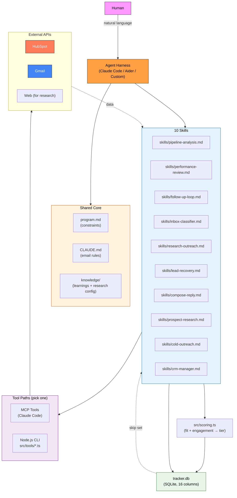

# Architecture

System design for the HubSpot Sales Agent. This doc is for readers who want to understand how the pieces fit together. For setup instructions, see [`setup.md`](setup.md). For the dashboard UI specifics, see [`dashboard.md`](dashboard.md). For harness-specific integration notes (MCP vs CLI trade-offs, how to adapt to Cursor / Continue / Aider / custom agents), see [`../AGENTS.md`](../AGENTS.md).

---

## Diagram



---

## Project structure

```
hubspot-sales-agent/
├── program.md                    # Shared constraints, setup, error handling
├── CLAUDE.md                     # Shared email generation rules (greeting, tone, templates)
├── AGENTS.md                     # Harness compatibility guide
├── skills/                       # 10 composable skills
│   ├── pipeline-analysis.md      # Full pipeline health check + recommendations (forward-looking)
│   ├── performance-review.md     # Closes the feedback loop — joins drafts with outcomes, proposes Section C rules (backward-looking)
│   ├── follow-up-loop.md         # Bulk outreach autonomous loop
│   ├── inbox-classifier.md       # 8-category reply classification + auto-drafts
│   ├── research-outreach.md      # Research-driven personalized outreach
│   ├── lead-recovery.md          # Decision framework for stale deals
│   ├── compose-reply.md          # Deep-context single-lead composer
│   ├── prospect-research.md      # Deep intelligence gathering — dossiers for cold-outreach
│   ├── cold-outreach.md          # First-touch cold emails — value-first, signal-based hooks
│   └── crm-manager.md           # Full HubSpot CRM management from terminal
├── knowledge/                    # Living knowledge base (edit for your business)
│   ├── learnings.md              # Living memory — skills read on every run, append at end (Section A cheat sheets, Section B running log, Section C distilled patterns)
│   ├── research-config.md        # Define your research/audit approach
│   └── scoring-config.md         # Define ICP + scoring weights + tier matrix
├── prompts/
│   ├── invoke-skill.md           # All skill invocations + workflows
│   └── run-followup.md           # Quick-start prompts
├── src/
│   ├── db.ts                     # Shared SQLite data layer (schema, prepared statements, TSV→SQLite import)
│   ├── tracker.ts                # Tracker CLI — thin wrapper over db.ts (read/rows/exists/append/update/export)
│   ├── scoring.ts                # Lead scoring CLI — fit + engagement scores → priority tier (A/B/C/D)
│   ├── learnings.ts              # Learnings CLI (append heartbeat/observation to learnings.md Section B)
│   ├── performance.ts            # Performance math (queries tracker.db via db.ts, computes per-segment contrasts → JSON for performance-review)
│   └── tools/                    # Harness-agnostic CLI wrappers
│       ├── hubspot.ts            # HubSpot REST API (17 commands: contacts, deals, tasks, notes, pipeline)
│       ├── gmail.ts              # Gmail API (OAuth)
│       └── webfetch.ts           # HTML fetch + basic audit
├── docs/                         # Deep-dive documentation
│   ├── setup.md                  # Credentials + install walkthrough
│   ├── architecture.md           # You are here
│   └── dashboard.md              # Dashboard UI details
├── output/
│   ├── research-reports/         # Full research reports per lead (markdown)
│   ├── analysis/                 # Pipeline analysis reports
│   ├── performance/              # Weekly performance-review reports
│   ├── lead-dossiers/            # Deep-context briefs from compose-reply
│   ├── prospect-dossiers/        # Strategic company dossiers from prospect-research
│   ├── errors.log                # Runtime error log
│   └── recovery-*.md             # Lead recovery analysis outputs
├── ui/                           # Local dashboard (Next.js 16, App Router)
│   └── src/                      # Pages + API routes wrapping the parent CLIs (see docs/dashboard.md)
├── tracker.db                    # Single source of truth (SQLite, gitignored) — as of v2.6
├── .env.example                  # Credential template
├── package.json
└── README.md
```

---

## Two tool paths

The agent is **harness-agnostic**. Every skill file references two interchangeable tool paths — pick whichever matches your setup:

### Path A — MCP ([Model Context Protocol](https://modelcontextprotocol.io))

Works with **any MCP-capable harness** — Claude Code, Cursor, Continue, Windsurf, Zed, custom harnesses with an MCP client, etc. Install the HubSpot + Gmail MCP servers and you're done (no `.env` needed for the MCP path — auth is handled by the harness).

MCP tool names depend on how your MCP server is registered. Skill files use a generic prefix (`mcp__hubspot__*`, `mcp__gmail__*`) — substitute your harness's actual prefix. See `CLAUDE.md` for the full tool list.

### Path B — Local CLI tools (universal fallback)

Works with **any harness** that can execute shell commands. Run `npm install`, fill in `.env`, and the agent shells out to `npx tsx src/tools/*.ts`. Use this when:

- Your harness doesn't support MCP yet
- You want to debug tool calls directly in the terminal
- You're building a custom Node.js/Python agent loop
- You prefer a minimal dependency footprint

You can also **mix both paths** — for example, use MCP for HubSpot and CLI for webfetch. See [`../AGENTS.md`](../AGENTS.md) for the full compatibility matrix.

---

## State files

The agent has two state files — both living in the repo, both are single sources of truth for their concern:

1. **`tracker.db`** — per-contact tracker (SQLite, 16 columns). Every draft, skip, error, reply classification lives here. Used by every skill for deduplication and reply tracking. Written via `src/tracker.ts` (thin CLI over `src/db.ts`), queried by `src/performance.ts` via an indexed range scan on `drafted_at`. **As of v2.6:** backed by SQLite (`better-sqlite3`) — fixes field escaping (tabs/newlines no longer corrupt rows), concurrency (WAL mode), and scales to tens of thousands of rows. Pre-v2.6 was a flat `table.tsv` file; on first v2.6+ run, any existing `table.tsv` is imported into SQLite and then deleted. Dump the current state to TSV or JSON on demand via `npx tsx src/tracker.ts export`.
2. **`knowledge/learnings.md`** — living memory (3 sections). Cheat sheets, running log, distilled patterns. Read by every skill at start, written via `src/learnings.ts` at end.

Weekly performance reports land in **`output/performance/<date>.md`** — written by `performance-review`, human reviews them to decide which Section C rules to promote.

### Tracker columns (16 total, SQLite schema in `src/db.ts`)

| Column | Description | Written By |
|--------|-------------|-----------|
| `email` | Unique identifier (lowercase, `COLLATE NOCASE`) | follow-up-loop, research-outreach, cold-outreach |
| `firstname`, `lastname`, `company` | Contact master data | follow-up-loop, research-outreach, cold-outreach |
| `lead_status` | HubSpot lead status at draft time | follow-up-loop, research-outreach, cold-outreach |
| `notes_summary` | 1-sentence summary; prefix indicates skill: `RES:`, `COMPOSE:`, `COLD:` | all outreach skills |
| `draft_id` | Gmail draft ID of outreach email | follow-up-loop, research-outreach, cold-outreach |
| `status` | drafted / skipped / error / declined / bounced / awaiting_human | all |
| `drafted_at` | ISO timestamp of draft creation | follow-up-loop, research-outreach, cold-outreach |
| `reply_received_at` | ISO timestamp when reply arrived | inbox-classifier |
| `reply_classification` | POSITIVE_INTENT / POSITIVE_MEETING / NEGATIVE_HARD / etc. | inbox-classifier |
| `reply_draft_id` | Gmail draft ID of reply draft | inbox-classifier |
| `hubspot_status_after` | HubSpot lead status after sync | inbox-classifier |
| `fit_score` | ICP fit score 0-100 (from HubSpot properties) | scoring.ts, prospect-research |
| `engagement_score` | Engagement score 0-100 (from tracker signals) | scoring.ts |
| `priority_tier` | Priority tier A/B/C/D (from fit x engagement matrix) | scoring.ts |

Indexes: `drafted_at` (performance windowing), `status` (UI filter pills), `reply_classification` (inbox-classifier queries), `priority_tier` (scoring queries). `email` is the primary key.

**Tracker CLI** (same contract pre- and post-v2.6):

```bash
npx tsx src/tracker.ts read                                           # JSON array of all emails
npx tsx src/tracker.ts rows                                           # JSON array of full row objects
npx tsx src/tracker.ts exists <email>                                 # "true" or "false" (case-insensitive)
npx tsx src/tracker.ts append "<tab-separated-row>"                   # add a new row
npx tsx src/tracker.ts update <email> <classification> [draft_id]     # set reply fields
npx tsx src/tracker.ts export [--format tsv|json] [--out path]        # dump current DB state (v2.6+)
```

**Scoring CLI** (utility, not a skill — called by other skills to prioritize contacts):

```bash
npx tsx src/scoring.ts score <email> [--data <json>]   # score one contact (fit from JSON, engagement from tracker)
npx tsx src/scoring.ts score-tracker                    # score all tracker contacts (engagement only, fit defaults to 50)
npx tsx src/scoring.ts rank                             # all scored contacts sorted by priority tier
npx tsx src/scoring.ts tier <email>                     # print priority tier for one contact
npx tsx src/scoring.ts update <email> <fit> <eng>       # manual score override
```

Configuration: [`../knowledge/scoring-config.md`](../knowledge/scoring-config.md) defines ICP weights and tier matrix.

**Learnings CLI** (written by skills at end-of-run, see `program.md` universal teardown rule):

```bash
npx tsx src/learnings.ts append heartbeat --skill <skill> --text "<one-line summary>"
npx tsx src/learnings.ts append observation --skill <skill> \
  --headline "..." --context "..." --observed "..." --apply "..."
```

Entries land in `knowledge/learnings.md` Section B (newest first). The file grows unbounded — trim manually via editor if it ever gets too long.

---

## Dashboard Level 3 architecture

The dashboard UI (in `ui/`) wraps the **same CLIs** the agent uses — no duplicate business logic, no cache layer, no data drift. See [`dashboard.md`](dashboard.md) for the full UI walkthrough.

```
Browser  ──HTTP──▶  Next.js API routes  ──execFile──▶  src/*.ts (tracker / performance / learnings)
                                                              │
                                                              ▼
                                               tracker.db + knowledge/learnings.md
                                                              ▲
                                                              │
                                                      Claude Code (agent)
```

The UI and the agent share one source of truth. Every API request re-runs the CLI — no server-side cache, no duplicated business logic, no data drift. Read-only on state; the only write path is triggering a skill (which runs in Claude Code, not in the UI server).
